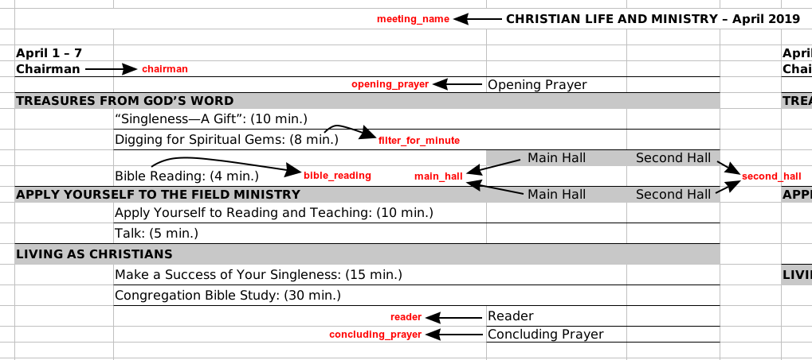

# WREX
Extracts the parts (presentations) in a meeting workbook and prepares an Excel document that makes assignments easy.

This project will probably be of no use to you fellow programmers out there. But in case you are interested and want to see what it can do, go ahead to [jw.org](http://jw.org) and grab what's called a meeting workbook in its **EPUB** format and give it to this app. The languages supported by this program are:

 - Amharic
 - English
 - Tigrinya

## Contribution
Any kind of contribution to this project is welcome. Some are listed next.
### Adding Language Packs
One way to contribute is to add a language(s). These language packs are needed to replace the texts you see indicated by the arrows on the image below. The program stores languages (language pack files) using Java's `Properties` file(s). This is the content of a typical language pack file (*English*):

    meeting_name=CHRISTIAN LIFE AND MINISTRY  
    chairman=Chairman  
    opening_prayer=Opening Prayer  
    main_hall=Main Hall  
    second_hall=Second Hall  
    reader=Reader  
    concluding_prayer=Concluding Prayer  
    # Test string(s)  
    bible_reading=Bible Reading  
    # Test string for the word "minute" (it's abbreviation in some languages).
    # Sometimes it is necessary to include the leading or trailing space character
    # right before or after the word
    filter_for_minute= min.  
    # Months  
    01=January  
    02=February  
    03=March  
    04=April  
    05=May  
    06=June  
    07=July  
    08=August  
    09=September  
    10=October  
    11=November  
    12=December
The image below shows the texts in the excel document that correspond to the given `values`:

To add a language:
 1. Create a file with the name of the language you want to add (eg. `german.lang` for German)
 2. Copy the sample provided above to the file and translate the `values` into the target language
 3. Put the file in `languages/`

The steps above are all you need to follow in order to add a language pack. It would help others if you can send me a PR with the newly added language appended to the list of supported languages listed in this README (above the  [**Contribution**](#contribution)  header).

Note that a language pack has a `.lang` extension. Also, be sure that you don't translate the keys (the texts to the left of the `=` sign) into the new language. You're supposed to translate the values (the texts to the right of the `=` sign) only.

### Internationalization
Effort was made to internationalize (i18n) <b>WREX</b> and it was successful. Head over to the `UITexts.properties` file in the program's
resources folder and do the same thing instructed with the language pack files and you can make <b>WREX</b> local to your own language. Right now, there is no option to change the program's interface language besides editing the specified file, but I plan to add it with the next few commits.

## Attribution
I would like to thank the following authors for providing free icons that I've used in **WREX**. You can find more about them and their work using the links provided.
- [Laura Reen](https://www.iconfinder.com/laurareen) from [iconfinder](https://www.iconfinder.com) for the `Schedule` icon on the JFrame's window .
- [Jozef Krajčovič](https://www.iconfinder.com/Jozef89) from [iconfinder](https://www.iconfinder.com) for the `Excel Document` icon on the `Generate` button .
- [Freepik](https://www.freepik.com/home) from [flaticon](https://www.flaticon.com)  for the `Open Folder` icon on the `Open` button .

Thank you and Enjoy!
